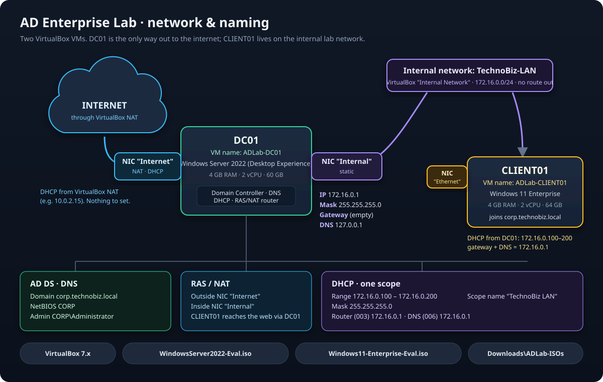

# AD Enterprise Lab Series on real VirtualBox VMs

This kit runs the same 11 labs as **IAM Range → AD Enterprise Lab**, but on two real Windows VMs. It works on Windows 11 **Home**, because it uses VirtualBox instead of Hyper-V.

```
 INTERNET ── VirtualBox NAT (plays the home router: DHCP 10.0.2.x, internet)
                 │  NIC "Internet"
               DC01   ADLab-DC01 · Windows Server 2022 Standard (Desktop Experience)
                 │  NIC "Internal"  ← you set 172.16.0.1/24 in Lab 01
          ── internal network "TechnoBiz-LAN" (no DHCP until Lab 04) ──
                 │  NIC "Ethernet"
             CLIENT01 ADLab-CLIENT01 · Windows 11 Enterprise
```

## Get the software (once)

Both the AD Enterprise Lab's **Real VMs** mode and the IAM Portfolio's **real-VM track** run on the same two VMs, so you build them once. In the app, **📘 Setup guide** (in both windows) shows these steps with working buttons.



1. **Install VirtualBox 7:** <https://www.virtualbox.org/wiki/Downloads> → *Windows hosts*. Keep the default install folder.
2. **Download Windows Server 2022** (the domain controller, DC01): <https://www.microsoft.com/en-us/evalcenter/download-windows-server-2022>. Fill in the short form, then pick *English (United States) → ISO downloads → 64-bit edition*.
3. **Download Windows 11 Enterprise** (the client, CLIENT01): <https://www.microsoft.com/en-us/evalcenter/download-windows-11-enterprise>. Pick *English (United States) → ISO – Enterprise download → 64-bit edition* (not LTSC).
4. **Rename and place them exactly like this.** The kit finds them by name:

   | Folder | `%USERPROFILE%\Downloads\ADLab-ISOs` |
   |---|---|
   | Server ISO | `WindowsServer2022-Eval.iso` |
   | Client ISO | `Windows11-Enterprise-Eval.iso` |

   ```powershell
   New-Item -ItemType Directory -Force "$env:USERPROFILE\Downloads\ADLab-ISOs"
   Move-Item "$env:USERPROFILE\Downloads\*SERVER_EVAL*.iso" "$env:USERPROFILE\Downloads\ADLab-ISOs\WindowsServer2022-Eval.iso"
   Move-Item "$env:USERPROFILE\Downloads\*CLIENTENTERPRISEEVAL*.iso" "$env:USERPROFILE\Downloads\ADLab-ISOs\Windows11-Enterprise-Eval.iso"
   ```

   Stored them elsewhere? Edit the two `isos` paths in `adlab.vbox.json` instead.
5. **Build:** run `01-New-AdLabVMs.ps1`, then `02-Initialize-AdLabGuests.ps1` (see [Scripts](#scripts)). In an installed app, this folder is `<install folder>\resources\omari-lab\10-AD-ENTERPRISE-VBOX`; the guide's **Open the kit folder** button takes you there.

Both ISOs are free 180-day Microsoft evaluations, about 5 GB each, and need no product key.

### Naming convention

The kit and the labs create these names, and the checks, snapshots and scripts look for them. Keep them as they are.

| Item | Name |
|---|---|
| VirtualBox group | `/TechnoBiz-ADLab` |
| Domain controller VM | `ADLab-DC01` (computer name `DC01`) |
| Client VM | `ADLab-CLIENT01` (computer name `CLIENT01`) |
| DC01 adapters | `Internet` (NAT) and `Internal` (TechnoBiz-LAN) |
| CLIENT01 adapter | `Ethernet` (TechnoBiz-LAN) |
| Internal network | `TechnoBiz-LAN` · 172.16.0.0/24 |
| DC01 internal address | 172.16.0.1 / 255.255.255.0 · DNS 127.0.0.1 · no gateway |
| DHCP scope | `TechnoBiz LAN` · 172.16.0.100–172.16.0.200 · router and DNS 172.16.0.1 |
| Domain | `corp.technobiz.local` (NetBIOS `CORP`) |
| Sign-in | `Administrator`, then `CORP\Administrator` once the domain exists. The password is `adminPassword` in `adlab.vbox.json` |
| AD Lab snapshots | `Lab01-Start`, `Lab02-Start`, … |
| Portfolio snapshot | `Portfolio-Base` (made by **Prepare DC01**) |
| Portfolio OUs | `Enterprise_Root` → `Tier0_Admins` · `Tier1_Systems` · `Tier2_Staff` (one OU per department) |
| Portfolio groups | `GG-<Department>` (people) · `GS-<Resource>-RW/RO` (access) · `Role-*` / `Res-*` (Project 2) |
| Portfolio work folders | `C:\IAM\<project>` · `C:\Shares\<Department>` |

## Before you build: turn off Windows' hypervisor

If Windows' own hypervisor is running, VirtualBox has to run on top of it and becomes very slow. The VMs fall minutes behind real time, stop taking keyboard input, and live snapshots can crash VirtualBox's service. Turn these off, then restart the PC:

- **Memory integrity:** Windows Security → Device security → Core isolation.
- **Virtual Machine Platform** and **Windows Hypervisor Platform:** "Turn Windows features on or off".
- **Hypervisor at boot:** run `bcdedit /set hypervisorlaunchtype off` from an administrator terminal.

To check it worked, run `(Get-CimInstance Win32_ComputerSystem).HypervisorPresent`. It must print `False`.

WSL2 and Docker Desktop need these features. Turn them back on (and use `hypervisorlaunchtype auto`) when you need those tools.

## Scripts

| Script | What it does |
|---|---|
| `01-New-AdLabVMs.ps1` | Creates both VMs, wires the networks, and starts unattended Windows installs. At full speed each install takes about 15–20 minutes. |
| `02-Initialize-AdLabGuests.ps1` | Waits for Windows, names the adapters `Internet`, `Internal` and `Ethernet`, allows ping, and saves the snapshot **Lab01-Start**. |
| `Get-AdLabFacts.ps1` | Read-only. Collects the facts that **Check My Work** grades. The app runs it for you. |
| `AdLab-Snapshot.ps1` | `-Save <name>`, `-List`, or `-Restore <name>` for both VMs at once. The app's **Start over** menu runs this same script. |
| `Remove-AdLabVMs.ps1` | Deletes the lab VMs and their disks, after asking. `-Only CLIENT01` removes just one. |

Settings live in `adlab.vbox.json`: VM names, RAM, ISO paths, MAC addresses, and the lab Administrator password. The ISOs are the free Microsoft **evaluation** editions, stored in `Downloads\ADLab-ISOs`. They work for 180 days.

## Doing a lab

1. Open **IAM Range → AD Enterprise Lab** and switch the environment to **Real VMs (VirtualBox)**.
2. Work inside the VirtualBox windows. Sign in as `Administrator` and open PowerShell (Admin). Use the same commands as the simulator, or the GUI tools.
3. Click **CHECK MY WORK**.
   - The app reads the VMs this lab uses, without changing them.
   - It turns what it finds into the same lab state the simulator uses.
   - It grades that state with the same checker.
   - The Ollama instructor then explains the result. It still never makes a change for you.

Labs 01–03 only use DC01. CLIENT01 can stay off until Lab 04.

## Starting over

One real environment runs the whole series, so each lab builds on the one before. Save points are VirtualBox snapshots:

| Save point | What it is |
|---|---|
| `Lab01-Start` | Fresh Windows on both VMs. Restoring it starts the whole series over. |
| `LabNN-Start` | The moment Lab NN began. When you pass a lab, the app offers to save the next one's start point. |

In the app, open **Start over ▾** and choose **Restart this lab**, **Restart the whole series**, or **Save this lab's start point**. From a terminal:

```powershell
.\AdLab-Snapshot.ps1 -Restore Lab01-Start     # start the whole series over
.\AdLab-Snapshot.ps1 -Restore Lab04-Start     # start Lab 04 over
.\AdLab-Snapshot.ps1 -Save Lab04-Start        # remember where Lab 04 begins
```

Saving shuts Windows down cleanly, takes the snapshot, and starts the VM again, which takes about a minute. Live snapshots, taken while the VM runs, froze the guest and crashed VirtualBox's service on a host like this one, so they are not used. If a save point with the same name already has later snapshots branching from it, VirtualBox won't delete it. In that case the old one is renamed `… (replaced <date>)`, and nothing is ever lost.

## Greenfield Build lab — build it all by hand

The scripts above build `ADLab-DC01` and `ADLab-CLIENT01` for you. **AD
Enterprise Lab → Greenfield Build — TechnoBiz Infrastructure by Hand** (in the
lab list under *Build it yourself*) is the opposite: you build the same design
yourself, from the Setup guide's naming table, on **two separate VMs** so the
scripted series is never touched:

| Item | Name |
|---|---|
| VirtualBox group | `/TechnoBiz-Build` |
| Domain controller VM | `Build-DC01` (computer name `DC01`) — NAT + Internal Network `TechnoBiz-LAN` |
| Client VM | `Build-CLIENT01` (computer name `CLIENT01`) — Internal Network `TechnoBiz-LAN` only |
| Everything inside Windows | exactly as in the naming table above (172.16.0.1/24, `corp.technobiz.local`, scope `TechnoBiz LAN` …) |

The lab's brief walks through seven phases — create the VMs in VirtualBox
Manager, install Windows and Guest Additions, DC networking, AD DS + DNS,
RRAS NAT, DHCP, domain join — each step with a tick box and an **Ask**
button for the Ollama instructor, which is given the whole build guide as
teaching material. In **Real VMs** mode, click **DC01** or **CLIENT01** to open
`Build-DC01` / `Build-CLIENT01` in their own VirtualBox windows, and **CHECK MY
WORK** reads them with the same checker as the series (`Get-AdLabFacts.ps1
-VmSet Build`; the adapter wiring is read from VirtualBox, so random MACs are
fine).

Two things the checker needs, both in Phase 2: **Guest Additions** installed
in both VMs, and the **built-in Administrator enabled with the password in
`adlab.vbox.json`** (on Windows 11: `net user Administrator /active:yes`).

## What changes compared with the simulator

- **Internet adapter:** DC01's Internet NIC gets `10.0.2.x` from VirtualBox NAT instead of `192.168.1.x` from a home router. No check depends on that address.
- **Command history:** the instructor reads your PowerShell command history (PSReadLine). It does not see the output, so it won't claim a command worked or failed.
- **DNS registrations:** a real DC registers *both* of its adapters in DNS. The checker accepts the internal record, and clients prefer the one on their own subnet.

## Installer workarounds built into `01-New-AdLabVMs.ps1`

- **Evaluation media and product keys:** evaluation ISOs stop with "cannot find the Microsoft Software License Terms" when given an empty product key. The generated answer file leaves the key out.
- **Windows 11 hardware checks:** Windows 11 boots in BIOS mode, with Microsoft's `LabConfig` switches skipping the TPM and Secure Boot checks. EFI plus TPM is extremely slow under a hypervisor.
- **SATA host I/O cache:** turned on. Without it, Windows 11 (26100+) Setup resets the virtual disk controller and waits forever.
- **Partition formatting:** the BIOS partition is formatted in the answer file. Newer Windows 11 Setup rejects an unformatted partition.
