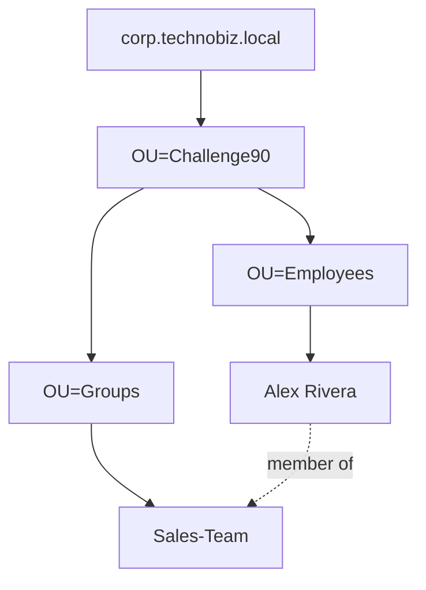

# Lab 1 — AD Enterprise Base

**Days 1–7 · Phase 1: AD Foundation · Repo:** `iam-ad-enterprise-lab`

## Do this lab in the app

Everything happens inside IAM Range, in its own domain `omari.test`
(`DC=omari,DC=test`). Use the buttons above: **Active Directory** to see and
click, **Terminal** to type the commands.

1. Open **Terminal** and build the OU tree, the group and Alex:

```powershell
New-ADOrganizationalUnit -Name Challenge90 -Path "DC=omari,DC=test"
New-ADOrganizationalUnit -Name Employees -Path "OU=Challenge90,DC=omari,DC=test"
New-ADOrganizationalUnit -Name Groups -Path "OU=Challenge90,DC=omari,DC=test"
New-ADOrganizationalUnit -Name Disabled -Path "OU=Challenge90,DC=omari,DC=test"
New-ADGroup -Name Sales-Team -GroupScope Global -GroupCategory Security -Path "OU=Groups,OU=Challenge90,DC=omari,DC=test" -Description "Sales department access"
New-ADUser -Name "Alex Rivera" -GivenName Alex -Surname Rivera -SamAccountName alex.rivera -Department Sales -Title "Sales Representative" -Path "OU=Employees,OU=Challenge90,DC=omari,DC=test" -AccountPassword (ConvertTo-SecureString "Lab1-Welcome!" -AsPlainText -Force) -ChangePasswordAtLogon $true -Enabled $true
Add-ADGroupMember -Identity Sales-Team -Members alex.rivera
Get-ADUser alex.rivera -Properties Department, MemberOf
```

   **Or do step 1 by clicks, the way you will on a real server** (do one or
   the other, not both — the second run finds everything already there).
   **Active Directory** is laid out like *Active Directory Users and
   Computers* (dsa.msc):
   - Right-click `omari.test` → **New → Organizational Unit** → `Challenge90`
     (leave *Protect container from accidental deletion* ticked). Right-click
     `Challenge90` → **New → Organizational Unit** three times: `Employees`,
     `Groups`, `Disabled`.
   - Right-click `Groups` → **New → Group** → `Sales-Team`, scope *Global*,
     type *Security*. Double-click it → *General* → Description
     `Sales department access` → **OK**.
   - Right-click `Employees` → **New → User** → First name `Alex`, Last name
     `Rivera`, logon name `alex.rivera` → **Next** → password `Lab1-Welcome!`
     twice, *User must change password at next logon* ticked → **Next** →
     **Finish**.
   - Double-click Alex → *Organization* → Job Title `Sales Representative`,
     Department `Sales` → *Member Of* → **Add…** → type `Sales` →
     **Check Names** → **OK** → **OK**.

2. Open **Active Directory**, expand `Challenge90`, open Alex's properties and
   screenshot the *Member Of* tab. Then **View → Advanced Features**, open Alex
   again and look at the *Attribute Editor* tab: `memberOf`, `department`,
   `userAccountControl` and `distinguishedName` are what the boxes you just
   filled are called in the directory.
3. Check and set the lockout policy:

```powershell
Get-AccountLockoutPolicy
Set-AccountLockoutPolicy -Threshold 5 -Duration 15
```

4. **Start → Sign out.** On the sign-in screen pick `alex.rivera`, sign in with
   the temporary password: you are forced to set a new one. Sign out again.
5. Pick `alex.rivera` and enter a wrong password five times: the account locks.
6. Sign back in as `admin`, then investigate and unlock. The help desk usually
   unlocks from the console: **Active Directory** → `Challenge90` →
   `Employees` → double-click Alex → *Account* → tick **Unlock account** →
   **OK** (or right-click Alex → **Reset Password…**, which shows the lockout
   status and can unlock too). The terminal does the same:

```powershell
Get-ADUser alex.rivera -Properties LockedOut
Get-IamAuditLog -Last 20
Unlock-ADAccount -Identity alex.rivera
```

7. Delegate, so the help desk can reset passwords without being Domain Admins
   (quick-review question 4). Right-click `Groups` → **New → Group** →
   `Helpdesk-Tier1`. Right-click `Challenge90` → **Delegate Control…** →
   **Next** → **Add…** → `Helpdesk-Tier1` → **Check Names** → **OK** →
   **Next** → tick *Reset user passwords and force password change at next
   logon* and *Read all user information* → **Next** → **Finish**. With
   **View → Advanced Features** on, Alex's *Security* tab now lists
   `Helpdesk-Tier1` with *Reset password*.

**Bonus — the classic ADUC build.** Most AD courses start with this exercise;
do it by hand once so the clicks are automatic. Inside `Challenge90`, create
the OUs `USA`, `Europe` and `Asia`; inside each of them `Users`, `Computers`
and `Servers` (the same names under different parents is fine — AD only
requires names to be unique among siblings). Inside `USA\Users` create an OU
per department — `IT`, `Accounting`, `HR`, `Sales`, `Management` — and three
people in each (right-click a user → **Copy…** is the fast way: it carries
the groups and department over). Leave the other two regions for Lab 2's
bulk script. Then **Move…** one person to another department, rename one
(**Rename** → *Rename User*), disable one (**Disable Account**), and use
**Action → Find…** to find someone by name.

`Lab1-Welcome!` is a practice password for the simulated domain only. The
"Hands-on lab" section below is the same work on a real Windows Server — keep
it for your GitHub scripts.

## Career objective

Stand up a clean, documented slice of Active Directory that you can administer,
troubleshoot and later automate. Every Junior IAM Engineer interview assumes
you can do this without a guide.

## Quick review (answer before you start, check after)

1. Security group vs distribution group — which one can appear in an ACL?
2. Where is the domain password and lockout policy stored, and which tool reads it?
3. Which event ID records an account lockout, and on which machine is it logged?
4. Name two tasks you would delegate to a help-desk group.
5. What is an OU for, and why is it not the same thing as a group?

## Scenario

HR has hired **Alex Rivera** into Sales. Create the account in the right OU,
add Alex to `Sales-Team`, set a temporary password that must be changed at
first sign-in, and prove Alex can sign in on CLIENT01.

## Concept

User lifecycle in AD: **create → place (OU) → entitle (group) → credential →
validate**. OUs are for *administration and policy* (delegation, GPO). Groups
are for *access* (ACLs, apps). Mixing the two up is the most common junior
design mistake.

## Reference environment (optional, outside the app)

You do this lab in the app (above). The commands below are the same work on
a real Windows Server, for your GitHub scripts — for example the VirtualBox
estate from the AD Enterprise Lab:

```
DC01      corp.technobiz.local   (AD DS, DNS, DHCP)   NetBIOS: CORP
CLIENT01  Windows 10, joined to the domain
```

Everything this challenge creates lives under its own OU,
`OU=Challenge90,DC=corp,DC=technobiz,DC=local`, so it never collides with the
OUs the AD Enterprise Lab grades. Take a VirtualBox snapshot named
`C90-Lab01-Start` before you begin.

## Hands-on lab

Run on **DC01** in an elevated PowerShell:

```powershell
Import-Module ActiveDirectory
$Domain = 'DC=corp,DC=technobiz,DC=local'
$Root   = "OU=Challenge90,$Domain"

# 1. OU structure (protected from accidental deletion by default)
New-ADOrganizationalUnit -Name 'Challenge90' -Path $Domain
foreach ($ou in 'Employees','Groups','Disabled','Service Accounts') {
    New-ADOrganizationalUnit -Name $ou -Path $Root
}

# 2. Security group. The parameter is -GroupCategory, not -GroupPurpose.
New-ADGroup -Name 'Sales-Team' -GroupScope Global -GroupCategory Security `
    -Path "OU=Groups,$Root" -Description 'Sales department access'

# 3. User with a temporary password typed at the prompt (never in the script)
$temp = Read-Host 'Temporary password for Alex' -AsSecureString
New-ADUser -Name 'Alex Rivera' -GivenName 'Alex' -Surname 'Rivera' `
    -SamAccountName 'alex.rivera' -UserPrincipalName 'alex.rivera@corp.technobiz.local' `
    -Department 'Sales' -Title 'Sales Representative' `
    -Path "OU=Employees,$Root" -AccountPassword $temp `
    -Enabled $true -ChangePasswordAtLogon $true

# 4. Entitlement
Add-ADGroupMember -Identity 'Sales-Team' -Members 'alex.rivera'

# 5. Verify
Get-ADUser alex.rivera -Properties Department, MemberOf, pwdLastSet |
    Select-Object Name, DistinguishedName, Department, MemberOf, pwdLastSet
```

`pwdLastSet = 0` is how AD stores "must change password at next logon".

### Lockout policy — check it before you test lockouts

A fresh domain ships with **LockoutThreshold = 0**, which means accounts never
lock. If you skip this check, step 7 below silently does nothing.

```powershell
Get-ADDefaultDomainPasswordPolicy |
    Select-Object MinPasswordLength, LockoutThreshold, LockoutDuration, LockoutObservationWindow

# Only if LockoutThreshold is 0:
Set-ADDefaultDomainPasswordPolicy -Identity corp.technobiz.local `
    -LockoutThreshold 5 -LockoutDuration 00:15:00 -LockoutObservationWindow 00:15:00
```

### Sign-in test (CLIENT01)

6. Sign in as `CORP\alex.rivera` with the temporary password. You must be
   forced to change it. Then run `whoami /groups` and find `CORP\Sales-Team`.
7. Sign out. Enter a wrong password 5 times. The account locks.

### Investigate the lockout (DC01)

```powershell
# 4740 is written on the DC that processed it (the PDC emulator). Property 1
# is the *caller computer name* — the machine that sent the bad passwords.
Get-WinEvent -FilterHashtable @{ LogName = 'Security'; Id = 4740 } -MaxEvents 5 |
    ForEach-Object {
        [pscustomobject]@{
            Time   = $_.TimeCreated
            User   = $_.Properties[0].Value
            Source = $_.Properties[1].Value
        }
    }

Search-ADAccount -LockedOut | Select-Object SamAccountName, LastLogonDate
Unlock-ADAccount -Identity alex.rivera
```

No 4740 events? Check auditing:
`auditpol /get /subcategory:"User Account Management"` must show *Success*.

## Validation checklist

- `OU=Challenge90` with Employees, Groups and Disabled, visible in Active Directory
- `alex.rivera` in `OU=Employees` with `Department = Sales`
- `alex.rivera` is a member of `Sales-Team` (Member Of tab screenshot)
- Lockout policy set: threshold 5, duration 15 minutes
- First sign-in as Alex forced a password change
- Alex locked after five wrong passwords, found in `Get-IamAuditLog`, then unlocked
- `Helpdesk-Tier1` delegated *Reset user passwords* on `Challenge90` (Delegate Control…)
- Attribute Editor screenshot of Alex showing `memberOf` and `userAccountControl`

## Challenge

After unlocking Alex, they still cannot open `\\DC01\SalesDocs`, even though
`Sales-Team` has Modify. List the checks you would run, in order, and why.

## Troubleshooting (guided)

1. Group membership is baked into the Kerberos ticket at sign-in. A new group
   means sign out/in, or `klist purge` then reconnect.
2. Share permissions and NTFS permissions both apply — the *most restrictive*
   wins. Check both tabs.
3. Confirm the ACL holds the group's SID, not a stale orphaned SID from a
   deleted-and-recreated group of the same name.
4. `Get-ADPrincipalGroupMembership alex.rivera` proves what AD thinks; `whoami
   /groups` proves what the token has. When they differ, it is the token.

## GitHub assignment

```
iam-ad-enterprise-lab/
├── README.md
├── docs/lab01-ad-base.md           steps + screenshots
├── scripts/New-C90BaseLab.ps1      the commands above as one script
├── architecture/ad-base.mmd        Mermaid diagram
└── troubleshooting/lockout-investigation.md
```



Never commit a real password. Screenshots: blur anything that is not lab data.

## Resume bullet

> Built and administered an Active Directory lab (Windows Server 2019) with a
> delegated OU model, security groups and a domain lockout policy; provisioned
> users end to end and traced account lockouts to their source with event 4740.

## Interview question

"Walk me through onboarding a new employee in AD, from the HR request to their
first successful sign-in." Answer with the five lifecycle steps and one thing
that can go wrong at each.

## Homework

- 150-word lockout write-up in `troubleshooting/lockout-investigation.md`.
- Screenshot or GIF of the forced password change.
- Read Microsoft Learn: *Delegating administration by using OU objects*.
